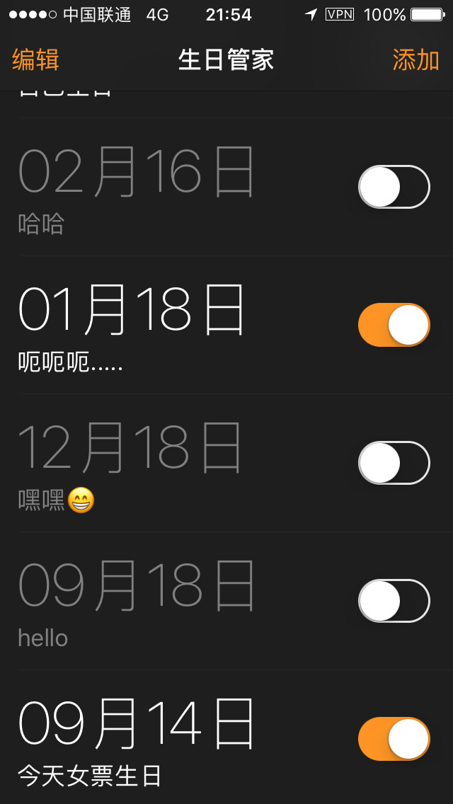
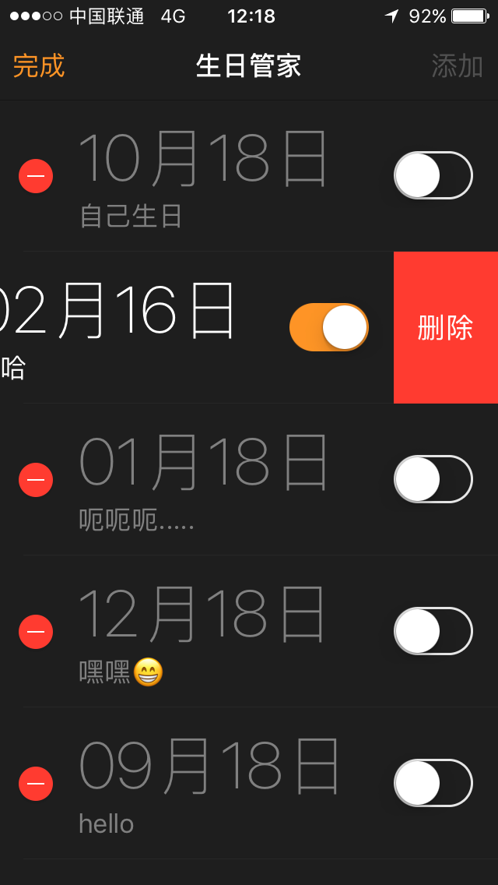
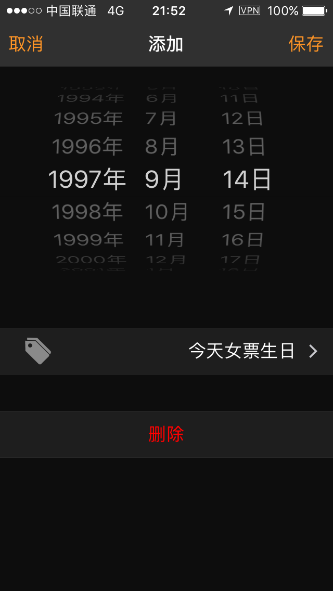
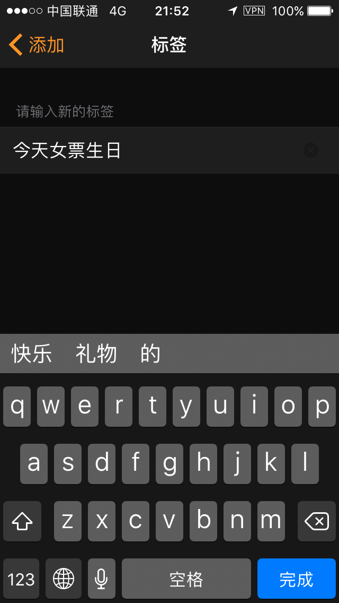
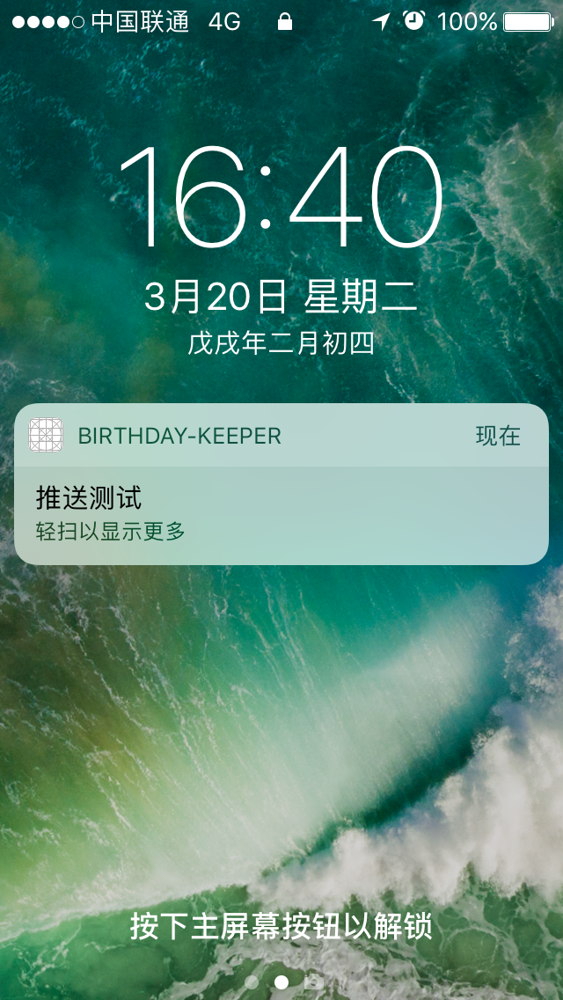
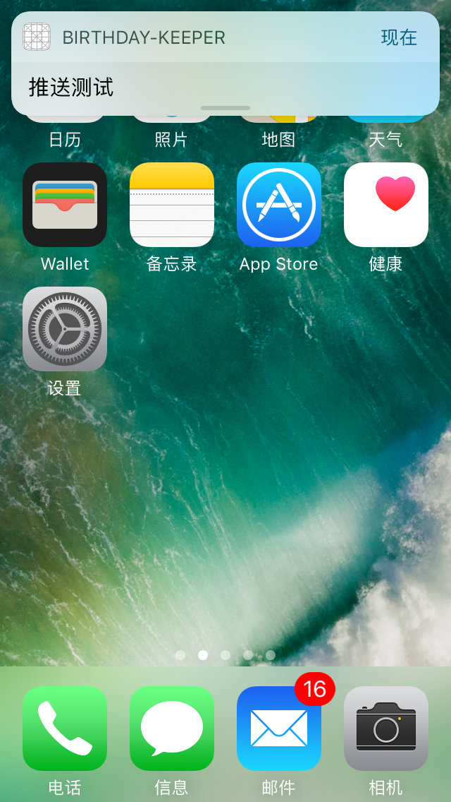

## 项目简介
- 一个生日管理APP, UI风格仿照的系统闹钟, 可以添加, 编辑, 删除生日以及本地推送提醒, 系统最低要求是iOS 9.0

## 主要思路
- 用户添加生日之后开启推送(默认关闭), 首先会根据现在的时间与用户选择的时间计算出第一次推送的时间, 最后设置推送周期为一年即可
- 项目整体采用MVC架构, 核心数据是一个BirthdayCellModel类型的可变数组birthdayInfo, 作为主控制器的一个属性, 用来保存添加过的生日信息
- 单例用于同步数据, 以便进行存储, 提取
- 在添加推送的时候, userInfo字典以创建的时间字符串(created time唯一)作为值, created time只在创建的时候被赋值
- 需要注意一下, 数据模型中的prompt(提示)和remindTime(提醒时间)中途写反了的, 后来干脆将错就错, 反正也不影响, 所以实际展示的时间来自prompt, 提示标签来自remindTime
- 有一个坑点需要注意, 用普通的方式是无法对可变数组添加观察者的, 需要调用一个KVC方法, 如下例子所示
```
//需要调用这个方法 mutableArrayValueForKeyPath:
[[self mutableArrayValueForKeyPath:@"birthdayInfo"] insertObject:[_tempCellModel copy] atIndex:0];
```


## 项目截图
### 主界面, 展示添加过的生日列表, 右侧的switch可以控制是否推送通知


### 编辑页面


### 添加生日界面


### 编辑提示标签


### 推送



## 联系
由于个人水平有限, 项目中还有很多不足的地方, 如果您有什么好的建议或者意见, 欢迎随时联系我
- QQ: 604399798
- 邮箱: chiron.yf@gmail.com
